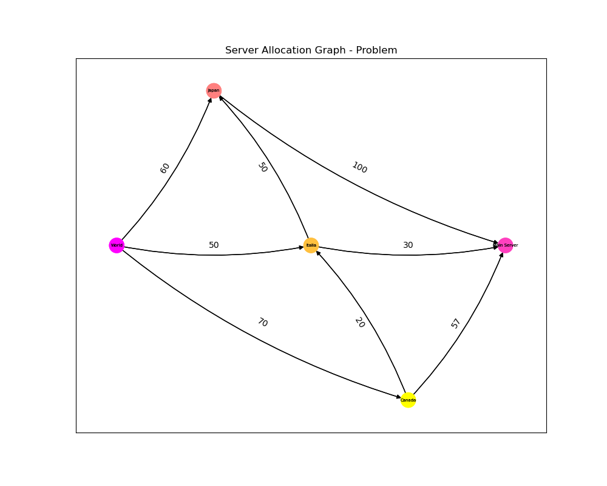
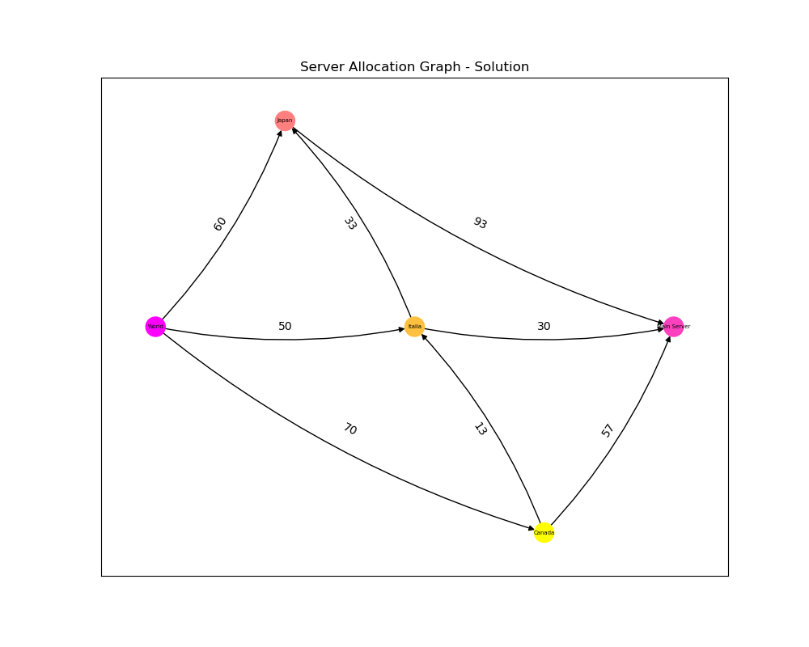

# Server Allocation Algorithm
## Background
Nowadays, people oftenly use internet. And because of social distancing, people meet online now. Online meeting is one of server intensive events. A single server will not be enough to handle many of these kinds of events. That's why we need a large number of servers. But how do we allocate these servers for countries accross the world?

## Description
This problem is a maxflow problem. We can represent each country as a node. For the edges, we can say that:
- A directed edge from country A to country B means that country B let country A to borrow its server.
- A directed edge from source to country A represents the server's usage of that country.
- A directed edge from country A to destination represents the server's allocation for that country.

## Prerequisites
### List
- Python 3.8    : https://www.python.org/downloads/
- networkx      : pip install networkx
- matplotlib    : pip install matplotlib

### Installation Steps
```pip install -r requirements.txt```

## Usage
### Normal
```python src/main.py```

### Input file
```python src/main.py < filepath```

## Output Images
Located in folder output.

### Sample Output



## Paper
Coming Soon